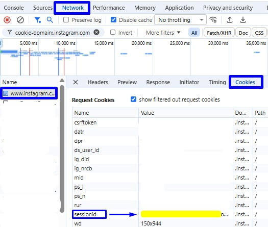
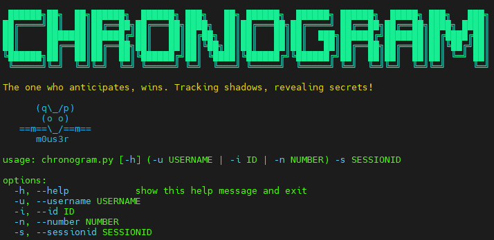

## CHRONOGRAM 

**ChronoGram** is a powerful, stealth-focused OSINT tool designed to extract deep metadata from Instagram profiles. Unlike standard tools, ChronoGram automates security protocols via the Tor network and organizes every investigation into professional workspaces.

**The origin of the name**: The name **ChronoGram** comes from the fusion of two Greek roots:
* **Chrono** (Greek *Khronos*): Representing **Time** and the timeline of investigation.
* **-gram** (Greek Suffix *-gramma*): Representing a **Written Record** or **Visual Representation**.
**ChronoGram** is designed to capture and record the digital evidence left behind in the social media timeline.

Together, **ChronoGram** represents the art of extracting and recording the chronological intelligence hidden within social media structures.


## Key Features: 

* **Stealth Mode:** Automated Tor service management with IP/Country verification and kill-switch protection.
* **Deep Extraction:** Recovers obfuscated emails and phone numbers even from private accounts.
* **Multi-Input:** Resolve targets using Username, User ID, or Phone Number.
* **HD Media Recovery:** Automatically downloads profile pictures in highest resolution.
* **Professional Reporting:** Generates clean, investigation-ready HTML reports.
* **Automated Workspace:** Creates dedicated folders for each target to keep your intelligence organized.

```

# 1. Clone the repository: 
git clone https://github.com/mym0us3r/Chronogram.git
cd Chronogram
chmod +x chronogram.py

# 2. Install Python dependencies: 
'requests' is the only non-standard library required (main library)
pip install requests

# Install SOCKS support (required for Tor stealth routing)
pip install pysocks

# 3. Install and start Tor (Linux/Debian/Ubuntu): 
# ChronoGram requires the Tor service to be active for stealth routing
sudo apt update && sudo apt install tor -y
sudo systemctl start tor

# 4. (Optional) Verify Tor status: 
# Ensure it's running on port 9050
sudo systemctl status tor

```
## How to get your SessionID ?

To use ChronoGram, you need a valid Instagram session cookie.



### Method 1: Via Application Tab (Easiest)
1. Open [Instagram.com](https://www.instagram.com) and log in.
2. Press `F12` > **Application** tab > **Cookies** (left sidebar).
3. Select `https://www.instagram.com`.
4. Find `sessionid` and copy its **Value**.

### Method 2: Via Network Tab (Chrome/Edge)
1. Open [Instagram.com](https://www.instagram.com) and log in.
2. Press `F12` > **Network** tab.
3. Refresh the page (**F5**).
4. Click on the first request (named `www.instagram.com`).
5. Under **Headers** > **Request Headers**, look for the `cookie` field.
6. Copy the value after `sessionid=`.

> [!WARNING]
> **Never share your SessionID.** It is equivalent to your password and gives full access to your account.

### Usage Examples: 


```
After setting up Tor and getting your SessionID, you can run ChronoGram using the following commands: 

# Search by Username (Most common)
python3 chronogram.py -u username -s YOUR_SESSIONID

# Search by User ID (Precise target)
python3 chronogram.py -i 123456789 -s YOUR_SESSIONID

# Search by Phone Number (International format)
python3 chronogram.py -n +5561999999999 -s YOUR_SESSIONID

```
## Disclaimer (Terms of Use):

**ChronoGram** was developed for educational purposes, authorized security auditing, and professional OSINT research only.

* **Ethical Use:** The developer is not responsible for any misuse, damage, or illegal activities caused by this tool.
* **Compliance:** Users are responsible for complying with their local laws and Instagram's Terms of Service.
* **Privacy:** Do not use this tool to harass, stalk, or infringe upon the privacy of individuals without legal authorization.
* **Account Risk:** Using automated tools with your `sessionid` may result in temporary or permanent account restrictions. Use dummy accounts whenever possible.

> **By downloading or using this tool, you agree to these terms.**

----------------------------------------------------------------------
**Contributors:**
ZEUS, the 30-day-old puppy guarding the source code :) 
---------------------------------------------------------------------- 
**Credits & Inspiration:**
This project was inspired by projects like instagrapi, toutatis and instainsane.
**ChronoGram** aims to expand on these concepts by adding automated Tor stealth routing, HD media recovery, and professional HTML reporting for investigators.

**License:**
This project is licensed under the GNU General Public License v3.0.
